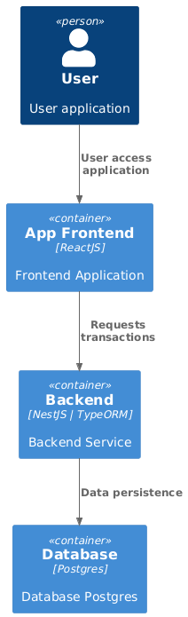
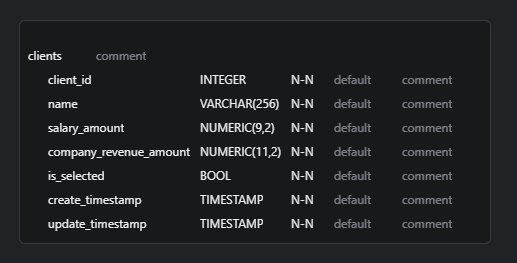
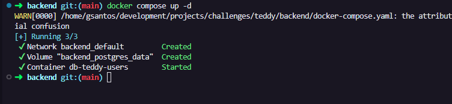
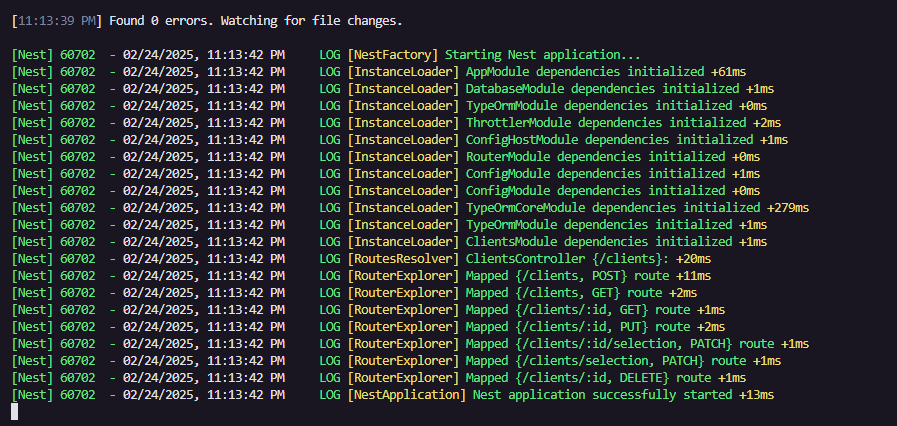
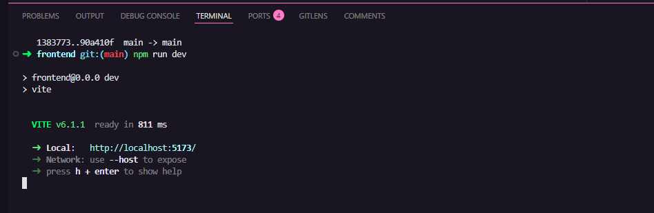

# Executando aplicações


## Arquitetura

Frontend em React + Vite para interface com o usuário.

Backend em NestJS para implementação de regras de negócio e comunicação com banco de dados.

Banco de dados PostgreSQL para persistência de dados.

TypeORM como ferramenta de Objeto-Relacional.

C4 (Contexto, Containers, Conmponentes e código) - Este modelo atende a camada 2.



DER (Diagrama Entidade Relacional)



Necessário apenas uma tabela para reepresentar a funcionalidade solicitada.

### Executando as aplicações

## Backend

CRUD simples de persistencia de dados da entidade usuário em banco de dados PostgreSQL, utilizando TypeORM e NestJS.

**Baixe a aplicação backend no repositório GIT com o comando:**

```bash
https://github.com/Gleydson07/teddy-backend.git
```

**Instale as dependências com o comando:**

```bash
npm install
```

**Copie o arquivo .env.example e cole com o nome .env apenas. No arquivo altere as variaveis de ambiente como preferir, para simplificar o processo, deixarei valores sugestivos.**

```bash
APP_PORT=3000

# DATABASE
SQL_PORT=5432
SQL_HOST="localhost"
SQL_USER="master"
SQL_USER_PASSWORD="MyP@ssw0rd"
SQL_DB="teddy-users"
SQL_SYNC=false
```

**Feito isso, execute o comando abaixo para que o container do banco de dados seja criado:**

```bash
docker compose up -d
```

Se o comando não funcionar, pode ser que sua versão esteja desatualizada, então execute o comando abaixo:

```bash
docker-compose up -d
```

Se tudo der certo, você verá um resultado semelhante ao abaixo:



**Execute o comando abaixo para iniciar a aplicação:**

```bash
npm run start:dev
```

O resultado deve ser semelhante a:



Para validar a conexão com a aplicação, utilize a collection abaixo com os endpoints já mapeados:

[collection](doc-files/collection)

Recomendo baixa a ferramenta de testes de API’s [Insomnia](https://insomnia.rest/download) ou qualquer outra semelhante (Postman, Insomnium).

## Frontend

Aplicação criada em React + Vite

**Baixe a aplicação frontend no repositório GIT com o comando:**

```bash
https://github.com/Gleydson07/teddy-frontend.git
```

**Instale as dependências com o comando:**

```bash
npm install
```

**Copie o arquivo .env.example e cole com o nome .env apenas. No arquivo altere as variaveis de ambiente como preferir, para simplificar o processo, deixarei valores sugestivos.**

```bash
VITE_APP_API_BASE_URL=http://localhost:3000
```

Obs.: A porta deve ser a mesma que estiver definida no APP_PORT do arquivo .env no backend.

**Feito isso, basta executar o comando abaixo para iniciar a aplicação:**

```bash
npm run dev
```

Se der certo, você deve ver algo como:



Acesse a rota http://localhost:5173/
